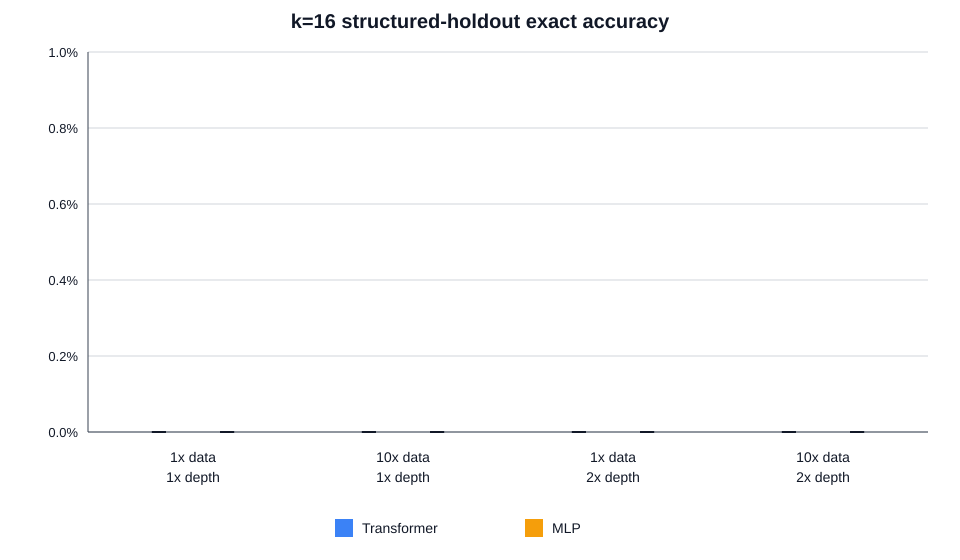

# k=16 data and model scaling results

The primary metric is exact sequence accuracy macro-averaged over `to_reduced_word`, `compose`, and `to_lehmer`. Values are mean +/- sample SD over three paired model seeds.

| Architecture | Condition | Structured loss | Structured token | Structured exact | Parity exact |
|---|---|---:|---:|---:|---:|
| transformer | `baseline` | 6.2055 +/- 0.8726 | 21.921% +/- 4.778% | 0.000% +/- 0.000% | 1.193% +/- 1.243% |
| mlp | `baseline` | 7.8868 +/- 1.2551 | 26.918% +/- 0.678% | 0.000% +/- 0.000% | 3.820% +/- 0.985% |
| transformer | `data10x_model1x` | 13.5609 +/- 1.3866 | 14.409% +/- 4.822% | 0.000% +/- 0.000% | 0.200% +/- 0.346% |
| mlp | `data10x_model1x` | 8.8903 +/- 0.9193 | 31.179% +/- 0.179% | 0.000% +/- 0.000% | 8.887% +/- 7.665% |
| transformer | `data1x_model2x` | 6.6041 +/- 1.4398 | 22.592% +/- 8.984% | 0.000% +/- 0.000% | 1.147% +/- 1.542% |
| mlp | `data1x_model2x` | 8.1911 +/- 0.5207 | 26.237% +/- 0.987% | 0.000% +/- 0.000% | 5.093% +/- 2.182% |
| transformer | `data10x_model2x` | 11.6767 +/- 1.1396 | 15.248% +/- 5.896% | 0.000% +/- 0.000% | 0.447% +/- 0.774% |
| mlp | `data10x_model2x` | 10.5254 +/- 0.9340 | 27.189% +/- 2.429% | 0.000% +/- 0.000% | 4.800% +/- 1.415% |

The table is descriptive with only three seeds. See `factorial_effects.csv` for seed-paired changes in structured loss, teacher-forced token accuracy, and exact accuracy. For loss, a negative contrast is an improvement; for accuracy, a positive contrast is an improvement. See `model_results.csv` for every endpoint and `PAPER_SECTION.md` for paper-ready Methods, Results, and Limitations.
